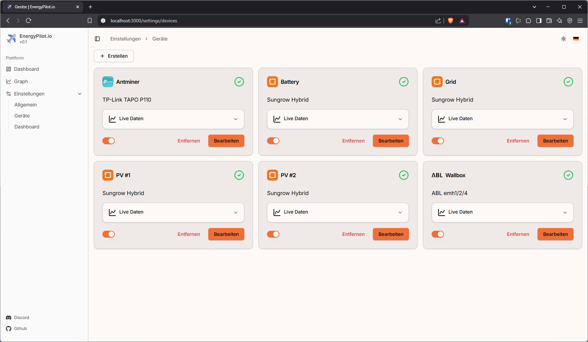

# EnergyPilot.io

EnergyPilot.io is an easy to use and feature rich Energy Management Platform focused on homes with solar energy production.




## Features

⚡ Modern and clean user interface

⚡ Easy to configure and use

⚡ Drag-and-Drop customizable dashboard

⚡ Ready to use Docker image

⚡ Multilanguage support

⚡ Light/Dark theme

## Supported devices

### Solar systems

- Sungrow Hybrid

### Wallboxes

- ABL emh1/2/4

### Other consumers

- TP-Link Tapo P1xx

## Support

If you would like to support this project, please consider buying me a coffee.

<a href="https://www.buymeacoffee.com/nekronomekron" target="_blank"></a>

## Getting started

### Requirements

- Node.js installation >= 22.12.0
- Clone/Download the Git Repository to your local drive

### Setup environment

Install all Node.js dependencies

```
npm i
```

Build the UI React application

```
npm run build
```

## Quick Start

Using [Docker-compose](https://docs.docker.com/compose/install/):

1. Copy the below docker compose example and update as needed:

```yml
services:
    energypilot-io:
        container_name: energypilot-io
        build:
            context: .
        environment:
            NODE_ENV: production
        volumes:
            # For persisting EnergyPilot's databases and common configuration
            - ./data/:/data
        ports:
            # Default Web UI Port
            - '3000:3000/tcp'
        restart: unless-stopped
```

2. Run `docker compose up -d` to build and start EnergyPilot.io (Syntax may be `docker-compose` on older systems).

> [!NOTE]
> Volumes are recommended for persisting data across container re-creations for updating images.

## Start local development server

```
node --import tsx server.tsx
```
