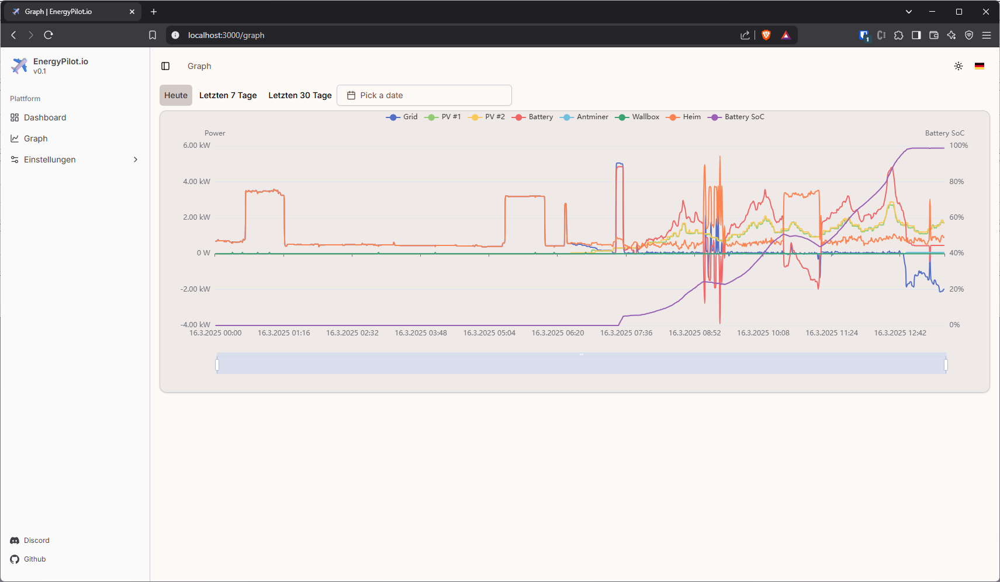

# EnergyPilot.io

EnergyPilot.io is an easy to use and feature rich Energy Management Platform focused on homes with solar energy production.




## Features

-   Modern and clean user interface
-   Easy to configure and use
-   Ready to use Docker image

## Support

If you would like to support this project, please consider buying me a coffee.

<a href="https://buymeacoffee.com/nekronomekron" target="_blank"></a>

## Getting started

### Requirements

-   Node.js installation >= 22.12.0
-   Clone/Download the Git Repository to your local drive

### Start the development server

```
node --import tsx server.tsx
```

### Build the Docker image

```
npm run build
```

```
docker build .
```

<!--
**energypilot-io/energypilot-io** is a ✨ _special_ ✨ repository because its `README.md` (this file) appears on your GitHub profile.

Here are some ideas to get you started:

- 🔭 I’m currently working on ...
- 🌱 I’m currently learning ...
- 👯 I’m looking to collaborate on ...
- 🤔 I’m looking for help with ...
- 💬 Ask me about ...
- 📫 How to reach me: ...
- 😄 Pronouns: ...
- ⚡ Fun fact: ...
-->
