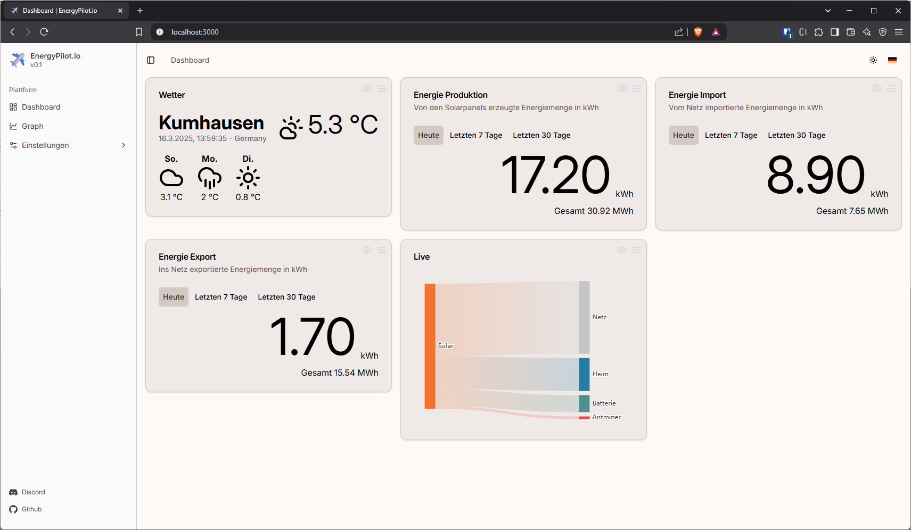

# EnergyPilot.io

EnergyPilot.io is an easy to use and feature rich Energy Management Platform focused on homes with solar energy production.




## Features

⚡ Modern and clean user interface

⚡ Easy to configure and use

⚡ Drag-and-Drop customizable dashboard

⚡ Ready to use Docker image

⚡ Multilanguage support

⚡ Light/Dark theme

## Supported devices

### Solar systems

- Sungrow Hybrid

### Wallboxes

- ABL emh1/2/4

### Other consumers

- TP-Link Tapo P1xx

## Support

Join us on Discord
<a href="https://discord.gg/YAsTew8m92" target="_blank">EnergyPilot.io@Discord</a>

If you would like to support this project, please consider buying me a coffee.

<a href="https://www.buymeacoffee.com/nekronomekron" target="_blank"></a>

## Quickstart

### Step 1: Ensure Docker Componse is installed

Docker Compose is the easiest way to start and maintain your Homebridge Docker image. Make sure you have the latest version of the docker-compose command installed on your system.

See https://docs.docker.com/compose/install/ for instructions.

### Step 2: Create Docker Compose Manifest

After ensuring Docker Compose is installed create a new file named docker-compose.yml that contains the following:

```yml
services:
    energypilot:
        container_name: energypilot-io
        image: energypilot/energypilot:latest
        restart: unless-stopped
        network_mode: host

        volumes:
            # For persisting EnergyPilot's databases and common configuration
            - ./data/:/data
        ports:
            # Default Web UI Port
            - '3000:3000/tcp'
```

> [!NOTE]
> Volumes are recommended for persisting data across container re-creations for updating images.

### Step 3: Start EnergyPilot.io

Run the following command to start the Homebridge Docker container:

```
docker-compose up -d
```

## Setup Development Environment

### Requirements

- Node.js installation >= 22.12.0
- Clone/Download the Git Repository to your local drive

### Setup environment

Install all Node.js dependencies

```
npm i
```

Install all Node.js dependencies for the server

```
cd ./server/
npm i
```

Build the Angular application and start your local instance

```
npm run start
```
